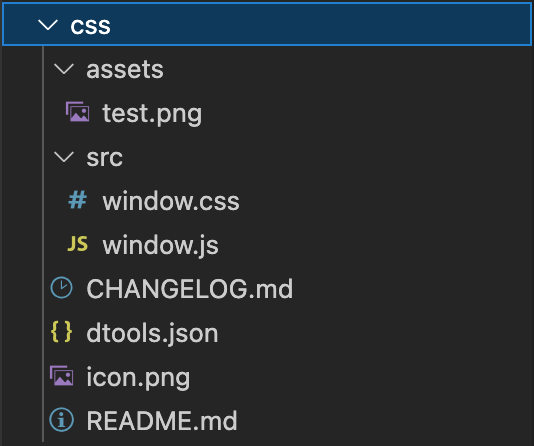

# dtools plugin
可以在dtools中安装并使用的插件。理论上vue项目构建生成的源码都是支持的。

⚠️目前尽量不要在代码中使用tauri的js api。

### 插件目录结构



1. assets: 存放代码中需要访问的本地文件（暂不支持，等待后续更新）
2. src: 存放vue项目构建生成的样式文件和脚本文件，名称固定为 `window`
3. README.md: 插件详细介绍（暂不支持，等待后续更新）
4. CHANGELOG.md: 插件版本变更记录（暂不支持，等待后续更新）
5. icon.png: 插件图标，大小最好是 256x256
6. dtools.json: 插件的配置文件

#### dtools.json 

```jsonc
{
    "name": "给点颜色看看", // 插件名称，必填
    "author": "Feint", // 插件作者，必填
    "desc": "一个常见颜色推荐工具", // 插件简介，必填
    "version": "0.0.1", // 插件版本，主版本.次要版本.修复版本
    "searchable": false,  // 
    "identifier": "com.feint.plugins", // 开发者标识符，必填
    "repository": "https://github.com/feint-demos", // 插件git地址
    "category": ["tools"],  // 插件类目，枚举待定
    "search-words": [""],   // 额外的快捷搜索词，例如插件名称为剪切板，这里可以添加：clipboard、cb等等
    "support-modes":["window"], // 插件支持的模式，枚举：window。（后续相关功能开发完成后，会支持更多的模式）
    "fileScope": [""], // 文件访问白名单，保留字
    "httpScope": [""] // http请求白名单，保留字
}
```

### VUE 项目注意点

需要讲 app 挂载到 `#plugin` 节点

```js
...
const app = createApp(App)
app.mount('#plugin')
...
```